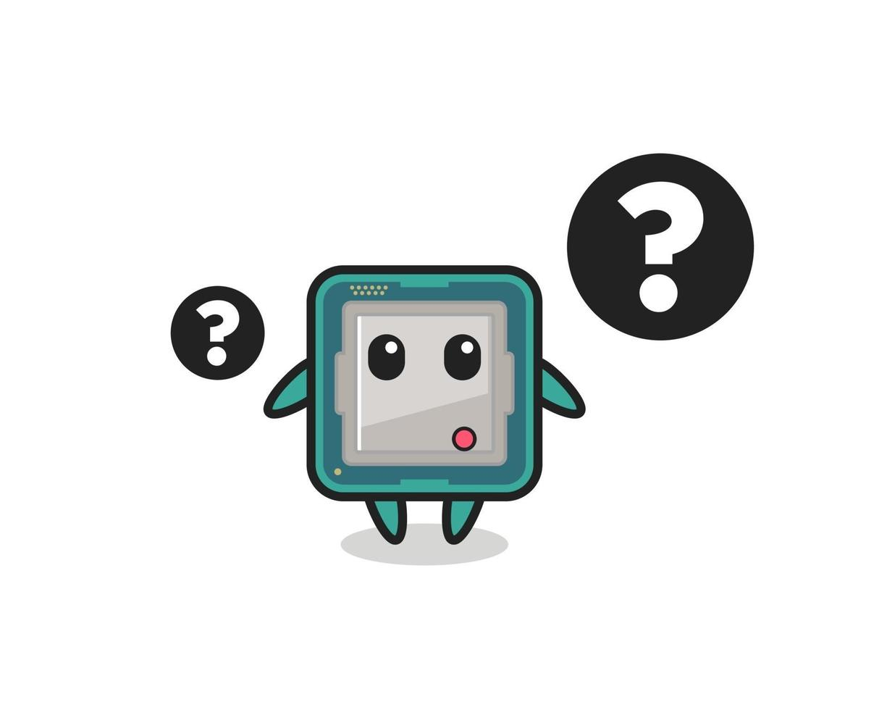

Authors:

- "0x42697262"
- Jinx
- Orochi

# Human Factors in Computer Security

Humans (or the human element) are the weakest link when it comes to security[^1].
Talk about how their day goes, empathize with them, share some of your experiences that relates with theirs, and then you get to achieve their trust by validating their feelings.
That's not exactly how it works in computer security however there are some similarities.
Take for example old websites that uses secret questions to recover your password or account.
What's the name of your pet? Who's your favorite teacher? Which school did you study? And the list goes on.
These personal information can all be taken online or by simply talking to the _human_.
This is what they usually consider as a Social Engineering attack.
Computer Security does not only contain software implementations and hardware designs, but also the human using the device.
However, human mind is difficult to comprehend as it involves a lot of phenomena.
Hence, the triggers and cause-effect events are heavily focused.

## Identifying the Threat Actor

Identifying the threat actors[^2] to a certain individual or organization may pose a challenge, however it is easy to guess; it's **you**.

Okay, no, not literally you but the "user" itself.
However, isn't the definition of a threat actor an external entity that poses a threat to an individual or organization? Well, yeah, but consider a situation where the user is guillible to the technology it possess.
They do not understand the concept of keeping one's self safe from the internet (internet because they're more likely to face threats there than their local network).

The user figures that it is safe clicking on web URLs and downloading strange executables does not pose much as a threat.
These actions introduces risks to the individual or organization.
Hence the user is the threat to its self.
The risks could be mitigated with proper training and decent knowledge.

The action that the user performed allowed "indiscriminate attacks" and these always happen on the wild, the internet.
A notable destructive instance of such attacks is the WannaCry ransomware, which occurred on May 12, 2017[^3].

On the event that there are certain threat actors targeting an individual or organization, they would do everything they are capable of in order to execute an attack successfully.
Even with the most secure software, completely locked down devices, and proper authority and control, it would still be possible to successfully launch an attack, albeit small a chance.

## Human Factors

The main idea in secure computing systems must be usable for ordinary people, hence the system must be designed to consider humans as a factor[^4].
A security system that is inconvenient for users to use or handle allows them to circumnavigate the implemented security protocols in order to make workflow _less inconvenient_.
Imagine a user with a personal computer not implementing any user management.
Its default behavior in interacting to the system is fully privileged, meaning the user have absolute power.
When the user deletes a system files, the system would not stop them.
This is the behavior that a user have experienced or habitualized for a long time.
Putting this certain user to a controlled environment like a work computer where a decent security protocols are implemented, this would provide inconvenience to the user.
An example of this would be requiring user password every time a privileged action is triggered, executing applications that requires system modification.
On this scenario, a user would simply want to disable such security protocol allowing anything to acquire privileged execution (like a root or admin access) when requested.
This would be an issue in security when strict protocols must be complied.

This is one of the human factors to consider in designing the security system.
Even if the user were to accept inconvenience, they are still vulnerable, but not limited to, social engineering attacks, carelessness, trust, awareness, knowledge, and other sociological or psychological actions.

### Social Engineering

Individuals can be manipulated to divulge sensitive information.
The more the threat actors interact with the user, the more they are able to gather information about them.
Threat actors could simply ask innocent questions over and over until they are able to gain your trust or obtain information.
Consider this example scenario, you received an email answering simple surveys for a university student's research (threat actor).
You gladly accepted them and answered the questions.
There was nothing harmful to that, however the researcher implied that there are people sending fake survey answers and it is ruining their data collection thus the researcher were forced to implement a verification system; through logging in with your legitimate accounts.
It can be your email accounts, social media accounts, or anything.
Rather than providing you with legitimate authorization protocol, the "student researcher" implemented a phishing website for your service.
This can go both ways, either you are able to notice the phishing attack or you were not aware of it.
That is simply one of multiple other scenarios that could have occured if you were to become their victim.

Now, let's assume that Two Factor Authentication is enabled.
The threat actors cannot gain access to your accounts even if they know the password to your account.
That is not an issue for them because it is simply an extra step (defense in depth in terms of security principles) that they could still attack you by implying a sense of urgency.
For example, the threat actor will pretend to be a customer service representative and will call or email you that they have noticed suspicious activities in your account.
They will say BS words that your account could have been attacked and that you have become a victim, thus they will send you a 2FA one time pin for the purpose of "verification".
The moment that you send the OTP code to the threat actors, you simply have fallen victim to a social engineering attack.

### Your Digital Footprint

This correlates with everything that you do on the internet on matter how secure you are.
**Security does not imply privacy.**
Your posts on social media, your comments on web forums, the websites you visited that are tracked by various companies, the computer you are using (hardware and software fingerprints), and etc.
Threat actors could find hidden gems about what you do online.
As a user, it's crucial to be mindful of their actions.
Try taking a look back to what you have done on the internet ever since you started using it.
Can you find them?
If not, then that's better by a tiny bit.
If yes, then it all depends on your threat actors if they ever find information about you useful.
Therefore, negligence is one of the human factors.

### Negligence Spells Disaster

When talking about human factors, we cannot forget about the capabilities of humans to find convenience in everything they do.
Be it booking a ride to go to another location instead of commuting, or buying kitchen appliances to help in preparing ingredients when a knife is just enough to do the work, humans have the habit to just find ways to make things easier.

This behaviour carries over in how users deal with the information and/or credentials they have online.
A scene that perfectly highlights this type of behaviour can be seen in the movie "Ready Player One", where the main character was able to log in the antagonist's acocunt using the password they left in plain sight beside their device.

Other examples include allowing passwords to be automatically saved in sites or telling other people sensitive credentials.

This negligence is easily exploited by others, especially those with access to the device the user usually uses.

### So Insecure, Just Like You

Humans are a huge security concern in computer security.
It is very difficult to train and it costs a lot of resources to do so.
What would be a viable approach?
The answer is **assurance**, just like in relationships.
Well, almost because when an individual in an organization gets _pwned_, the organization must be assured that the damage inflicted will be minimal.
This can be done by limiting the user's capabilities, their permissions, or separating their responsibilities in the organization.
In this manner, the threat actors would have to spend more effort in attacking an organization.
It is now up to them if it's worth their time to break into a safe lock whose estimated value is unknown.
Basically, security is economics ;)

This simple assurance that an individual is and should only able to do one thing can lessen the impact it will cause to the organization.
If ever there's only the individual as the target, the same concept can be applied to the software and tools the user use.
This makes your insecurity less of a concern.

## You Have Been Pwned

The user or organization has fallen victim to cyber attacks, now what?
Typically you would want a damage control and then boot off the threat actor.
But that's simply for another writeup.
There are mitigations and suggestions in preventing cyber attacks.

## Prevention is Better Than Cure

When preventing attacks ever fails, make sure to ALWAYS detect them otherwise it would be harder to control the damage the threat actors would impact.

### Secure Like A Castle

Implement not just one, not just two, but multiple layers of defense.
Think of it as comparing to running a marathon.
Having multiple obstacles that a runner will have to jump would exhaust them more compared to simply having only very few obstacles in place.
Then again, those defensive layers must also be strong otherwise the threat actors would just go pass through it.
Just like running over the obstacles in the path.

### GAMEMODE SURVIVAL

Don't give yourself or a user full privilege.
Simply give them enough permissions for the tasks they would need.
However, make sure that it's convenient otherwise the same human factor would render this mitigation useless.
At this point, the user should only do one thing at a time they are supposed to do.
If an individual is tasked to clean the floors, they should not be allowed to clean the table or access restricted areas.

### Cheat Skill: Clairvoyance

Assume that your threat actors know everything about you or the organization.
Obscurity is not a proper defense, its purpose is to only annoy the threat actors with little willpower to pursue an attack.
Thus, if you think that your security can be broken easily, make sure to change that for a better implementation.

### Divide By Zero

If something fails, a fail-safe mechanism should have been implemented in a secure way.
Imagine going to a restricted area requires an authorized access through an elevator.
That elevator fails.
But there is an emergency exit that can be used to access the restricted area.
Take that as a simple consideration.

The system must be built with security in mind from the start.
Otherwise it would be difficult to implement new changes.

### Have Complete Trust?

If you outsource your tools, people, and other things then make sure they can be trusted.
For example, hardware manufacturers.
Majority of the individuals or organizations does not build their own hardware.
Thus, they buy from hardware manufacturers.
They should be trusted and should only do actions they are expected to.
If they were to be compromised, then expect that you're as good as compromised as well.

## Final Thoughts

Despite the technological advancements of software and hardware, the actions and decisions of humans do significantly influence technological security.
Throughout this writeup it is evident that human behavior, tendencies, and vulnerabilities is recommended for designing effective security protocols.
From social engineering tactics to negligence in handling sensitive information, humans are vulnerable to threats that can compromise the security of computer systems and data.

But even with the vulnerability of human’s mistakes and decisions we can still protect them by implementing multi-layered defense mechanisms, limiting user privileges, and adhering to secure development practices for overall security resilience.
Prevention, detection, and response strategies should be implemented to effectively combat evolving threats.

All in all, while the technological advancements continue to enhance security measures, the human element remains central to the equation.
By educating users, implementing robust security measures, and fostering a culture of vigilance we can at least help users in mitigating the risks associated with human factors in computer security.

# Extra

## IT'S JOEVER. JOEWARI DA.

**CAN YOU TRUST YOUR COMPILER?**

The irony of this all is that it would be impossible to fully trust a system even if it contains **Trusted Computing Base** for all of its operations.
There is no way to confirm that your compiler can be trusted[^5].
No one is stopping malicious actors (it could be the developer or manufacturer) attaching malicious instruction set to your compiled binary.
There is no way to confirm the compiler that you created yourself can be trusted because the processor cannot be verified to be trusted.
There is no way to verify that every microcomponents or hardware in your computing device can be trusted.
All of these can be solved if you developed your own hardware and software tools.
Everything is placed on trust.
Trust that the computer would not operate outside of its expectations.

# References

[^1]: https://www.kuppingercole.com/events/csls2022/blog/human-factor-in-cybersecurity-the-weakest-link
[^2]: https://www.ibm.com/topics/threat-actor
[^3]: https://www.cloudflare.com/learning/security/ransomware/wannacry-ransomware/
[^4]: https://textbook.cs161.org/principles/principles.html#12-consider-human-factors
[^5]: https://www.cs.cmu.edu/~rdriley/487/papers/Thompson_1984_ReflectionsonTrustingTrust.pdf
