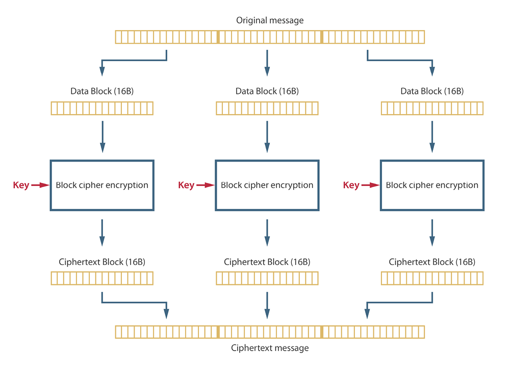

Authors:

- 0x42697262
- Jinx
- Orochi

# Symmetric Key Cryptography

Imagine trying to keep a secret by yelling it across a crowded room while everyone uses the same codebook to decipher your message. That's basically the gist of symmetric key cryptography – it's like trying to be sneaky with a megaphone.

Sure, this type of encryption does the bare minimum to scramble your data, but it's not exactly Fort Knox. We're going to dive into why symmetric key cryptography often leaves you feeling a bit exposed, and why sometimes, having the same key for everything is like leaving your house key under the welcome mat.

## Semantic Cryptography

### IND-CPA

**Indistinguishability under chosen plaintext attack** or **IND-CPA** refers to a game used to check CPA security on any given encryption method.
The game works like this:

1. The encryptor ($Enc$) will give out a public key to the attacker ($A$) while keeping the private key.
2. A will then give two same-length messages $m_0$ and $m_1$ to the $Enc$.
3. $Enc$ will choose a random bit $b \in \{0, 1\}$ to encrypt both messages.
4. $Enc$ will give out $C_0$ to the $A$.
5. $A$ will guess $b\prime$, and if $b\prime = b$, then $A$ will win.

Another way of referring to the win conditions of this game is the **_Probability of_** $A$ **_winning_** $\bf{-1/2 + \varepsilon}$, where $\varepsilon$ is a very small number.
This means that an encryption method will be CPA secure if the attacker has a very negliglible advantage in winning the IND-CPA game.

The formal definition of having achieved CPA security is:

$$
\text{An encryption method is CPA secure if}\ \forall\ m_0\ \text{and}\ m_1\ \text{such that}\ \vert m_0 \vert\ =\ \vert m_1 \vert\ \forall\ A
$$

$$
A^{Enc}(Enc(m_0)) \approx A^{Enc}(Enc(m_1))
$$

To sum up the definition given above, an encryption method will be CPA secure if for all pairs of messages that have the same length, the probability to guess $b$ on $m_0$ must be approximately equal to the probability to guess $b$ on $m_1$.

So, if the encrypted message is distinguishable other than from randomness, then its not CPA secure.

### ECB

The **Electronic Code Book** or **ECB** is a simple encryption method that incorporates a block cipher.

It splits the plaintext into different blocks of the same size, usually 16 bytes.
Each block is independently encrypted with the encryption key, which results in identical blocks having the same ciphertext after encryption.

Considering the nature of ECB, we can make a "_code book_" of all possible ciphertext of any given key. With this "_code book_", encryption is made possible by looking up the plaintext and choosing the corresponding ciphertext of the given key, thus the method is aptly named.

### Is ECB IND-CPA secure?

The ECB encryption method is not IND-CPA secure due to its deterministic characteristic.
The nature of the ECB makes it so that identical blocks of plaintext have the same ciphertext, leaving patterns present in the plaintext to be left behind in the ciphertext.
This makes it vulnerable to pattern recognition and frequency analysis.

Take this for example:

> If $m_0$ refers to the plaintext _"timewaitsfornoone"_ and $m_1$ refers to the plaintext _"sometimeinthefuture"_, and each block will contain 4 bytes each, are there any identical blocks?

The block _"time"_ appears in both plaintext, and when encrypted with the same key, will result in the same ciphertext.

By exploiting the repetitive patterns resulted from identical plaintext, the attacker in the IND-CPA game will have a significant advantage in figuring out what $b$ they used in encryption.

Meaning that ECB is not IND-CPA secure due to its inability to be indistinguishable under a chosen-plaintext attack.

## IND-CPA Secure Cryptography: Cipher Block Chaining

An alternative to ECB mode is **Cipher Block Chaining** (CBC) along with the other modes such as OFB, CFB, and CTR.

To show that CBC is IND-CPA secure, we first have to understand the encryption process.

In CBC mode, each block of plaintext is **XOR**ed with the previous ciphertext block before being encrypted.
This means that the _encryption_ of each block **depends** on the ciphertext of the **previous block**.
The first block is XORed with an **Initialization Vector** (IV), which is a random block chosen at the beginning of the encryption process.

> Note that the IV does not require to be secret. It is intended to be known by the sender and receiver.

Now that we understand how it works, we can proceed to show that CBC mode is IND-CPA secure.

> Let $m_0$ be _"THAT CAT IS MINE"_ and let $m_1$ _"YOUR CAT IS LOST"_ be the chosen plaintexts.
> Let $c_0$ be the ciphertext of $m_0$ and let $c_1$ be the ciphertext of $m_1$.

A random IV is chosen either randomly or through an algorithm, and then XORed with the plaintext.
The resulting outcome is then encrypted with the key.

The encrypted ciphertext output will be the ciphertext of the first block, which will then be XORed with the next plaintext block and encrypted with the key.

Unlike ECB mode, each block in CBC will have a different ciphertext, even if the plaintext messages are the same.
Thus, preventing any leakage of plaintext information.

## Conclusion

So, there you have it. Symmetric key cryptography, while a good starting point, is a bit like securing your valuables with a padlock made of cheese. Sure, it might deter the casual nibbler, but a determined adversary is going to have a feast.

We've learned that playing encryption hide-and-seek with a predictable pattern (thanks, ECB) isn't the brightest idea. And, just like you wouldn't use the same key for your house, car, and secret candy vault, diversifying your encryption methods is key (pun intended) to keeping your digital goodies safe.

Remember, in the world of cybersecurity, being a little bit paranoid is often a good thing. So upgrade your encryption game, mix it up, and don't be afraid to get a little weird with your ciphers. After all, a confused attacker is a safer you!