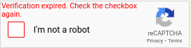
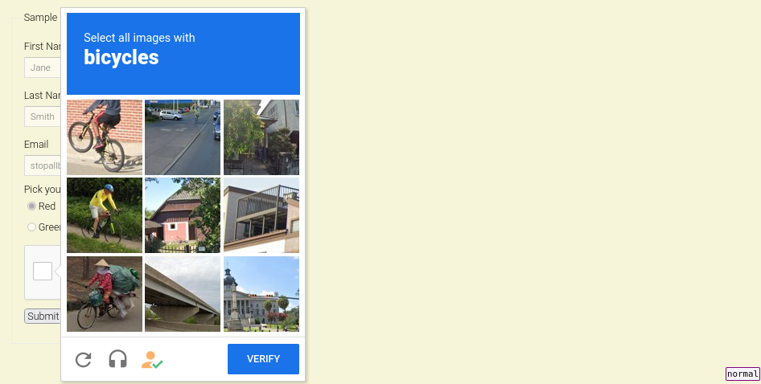
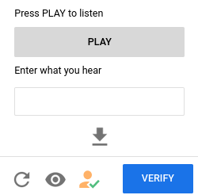

Authors:

- 0x42697262
- Jinx
- Orochi

**To prove that you are human, please complete this [assessment](https://www.youtube.com/watch?v=dQw4w9WgXcQ) first.**

Once done, please proceed to the writeup below. 
Thank you.

---

# CAPTCHAs

After using the internet for over 14 years, CAPTCHAs can be as annoying as pop-up ads if you don't have a decent adblocker installed.
CAPTCHAs are not bad, their purpose is to prevent bots from mascarading the website you visit so that you will never experience slow and terrible service.
However, it gets annoying when you visit a website for the first time.

## Why it only works on the surface level

CAPTCHAs does not even work.
If a threat actor is willing enough, they can defeat the CAPTCHA with some effort and financial expenses.
Here's a real life example, a [simple multiplayer game](https://agar.io) implemented CAPTCHA because cheating through bots has been getting bigger.
Every once in a while, you have to complete a CAPTCHA test in order to spawn.
Moneyclip's— err, MiniClip's goal was to prevent bots from overwhelming the game server.
However that does not work, there are still bots in the game!
Anyone can simply reuse a valid CAPTCHA cookie to spawn the bots and start messing around.

Granted, this prevents terrible cheaters from spawning bots but this does not stop the competent ones from evading CAPTCHAs.
It served its purpose on deterring overall cheaters but at the same time it introduced inconvenience to legit players who truly enjoys the game.

Aside from this frustation alone, CAPTCHAs' annoyance does not only limit on games but to certain tasks that users have to access for a brief moment only to be blocked by a traffic-like CAPTCHA test.
Answering the test within 30 seconds is alright.
What is not alright is when you have to repeat the test ***again*** because the attester thought that you are a bot and have to redo it again...

Then again, and again.
Wasting at least 1 to 3 minutes of your time.

And then there are moments where you have to reload the page because the session has expired and no longer valid to be submitted...
Well, have fun and redo the CAPTCHA test again.
Maybe that is simply a skill issue?

What if I am actually a robot?

Should I stop poking around `robots.txt`?

Or could it be my proxy or VPN is the cause?

Nada, it's the captcha.

Google's reCAPTCHA is infuriating as a user.
So is Cloudflare's hCaptcha.

As a user, CAPTCHAs are inconvenient, an annoyance, and a time wasting technology.

## But muhh server!

Rumor goes around that half of the users on the internet are actually robots.
Can't deny nor confirm.

In the point of view of developers, CAPTCHAs are an effective way to prevent bruteforce attacks on the website.
As well as spammers and botters.
It is a simple tool that can prevent attacks in the wild.

It works well for small web servers that cannot handle a lot of traffic or online stores that are vulnerable to bots.
But then again, botters can still win and bypass the CAPTCHAs.
Even someone who has no knowledge about technology can bypass CAPTCHAs.

For example, you can install [buster](https://github.com/dessant/buster) as a browser extension.

And simply select the icon-button and enjoy bypassing it for free.
What buster did was to use artificial intelligence to bypass the audio test by using speech-to-text recognition.

This attack focused on user accessibility, allowing us to bypass the CAPTCHA test.
Because not everyone have eyes that can see, thus an audio test is implemented for handicapped individuals.

Well, this is inefficient if you wanted to create a bot that can overwhelm a server.
But the same methodology can be applied to bypass Google's reCAPTCHA (bypassing Cloudflare's hCaptcha would require [Privacy Pass](https://blog.cloudflare.com/privacy-pass-standard) provided by Cloudflare) depending on the resources available.
However, that is still quite inefficient.
The most effective way to bypass CAPTCHAs is to pay people around the world to solve the CAPTCHAs for you.
If you have seen job postings that mentions _Work passively anytime!_, _Only typing!_, or _Earn $$$ within X hours!_ (non-verbatim), then that is what CAPTCHA solver services thus.
They offer a paid plan for you to buy and then use it to bypass CAPTCHA tests.

## This writeup is definitely not written by a bot

*So, are CAPTCHAs worth it?*
Eh, it really depends on which point of view we are looking at.
If majority uses CAPTCHAs to deter bots, spammers, and bruteforce attacks then they are worth it.

*Do I think they work?*
Yes, they work but not 100%.
CAPTCHAs are an extra layer to security to web servers.
It is not a magic bullet that stops all bots.
If it were, then that server simply does not accept any request then.
It wouldn't be called a server at this point.

*Is it more trouble than it is worth?*
As a developer, no.
As a user, yes.
But over time, users would just accept the fact that CAPTCHAs are part of the internet and becomes ingrained with them.
Making the pain a part of browsing the internet.

## What's the alternative then?

Attesters.
Not [this](https://github.com/explainers-by-googlers/Web-Environment-Integrity/issues/28) attester.
That's simply terrible and breaks the internet due to browser monopoly.

Okay, maybe not attesters but surely CAPTCHAs that checks your digital fingerprints *might* be a good way to validate your existence is either a human or a robot.
